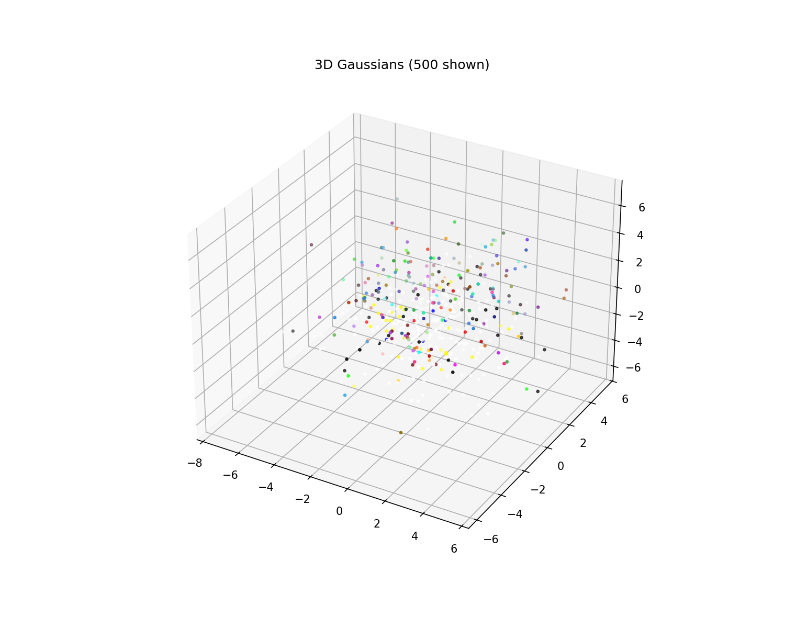
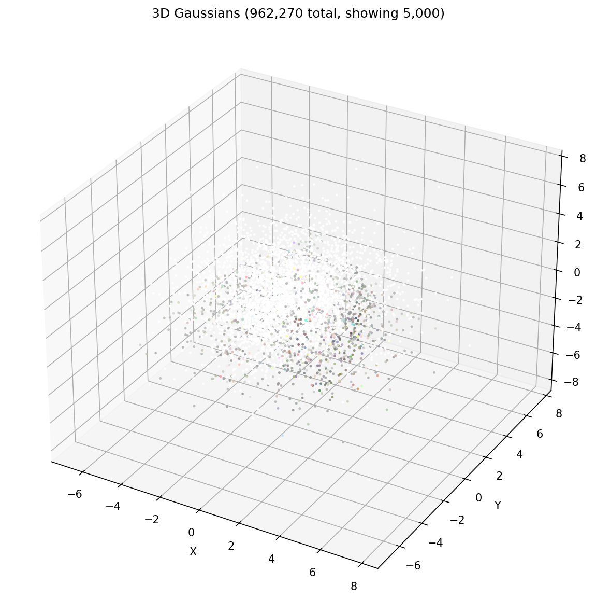
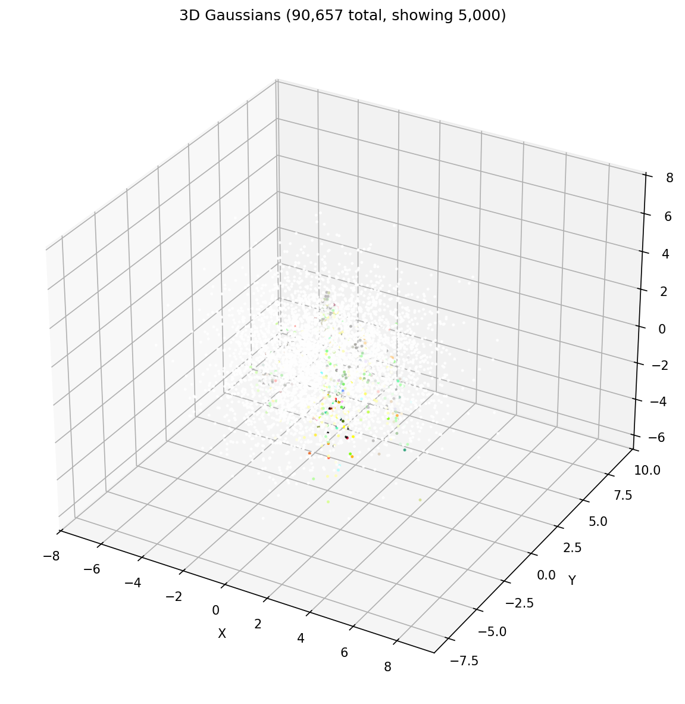
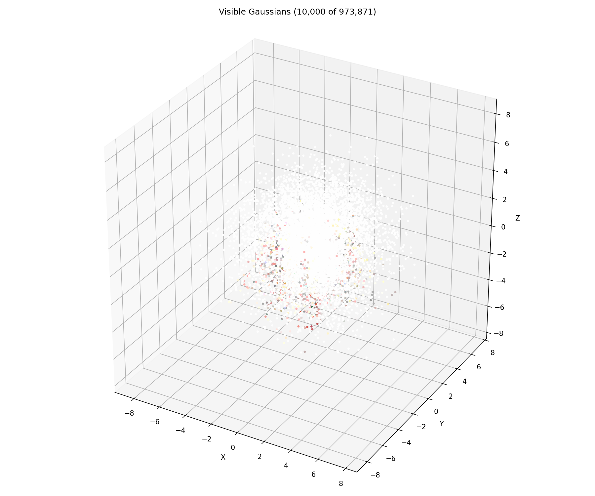

# 🚀 3D Gaussian Splatting - From Scratch Implementation

[](https://python.org)
[](https://pytorch.org)
[](https://colab.research.google.com)
[](LICENSE)

> **A complete PyTorch implementation of 3D Gaussian Splatting for Real-Time Radiance Field Rendering (SIGGRAPH 2023)**

<p align="center">
  
</p>

---

## 📋 Overview

This repository implements **all core components** of [3D Gaussian Splatting](https://repo-sam.inria.fr/fungraph/3d-gaussian-splatting/) from scratch in PyTorch.

### ✨ Key Features

- 🔧 **From Scratch**: No external 3DGS libraries - pure PyTorch implementation
- 🚀 **Colab Ready**: Train directly in Google Colab with T4 GPU
- 📊 **Complete Pipeline**: Data loading → Training → Visualization
- 🐍 **Modular API**: Importable components for custom training scripts

---

## 🎯 Results

Trained on **NeRF Synthetic** dataset scenes:

### Ship
<p align="center">
  
</p>
<p align="center">
  
</p>

### Drums
<p align="center">
  
</p>
<p align="center">
  
</p>

### Chair
<p align="center">
  
</p>
<p align="center">
  
</p>

### Lego
<p align="center">
  
</p>
<p align="center">
  
</p>

---

## 🧠 3D Gaussian Visualization

<table>
<tr>
<td align="center"><br/><b>Lego</b></td>
<td align="center"><br/><b>Ship</b></td>
<td align="center"><br/><b>Chair</b></td>
<td align="center"><br/><b>Drums</b></td>
</tr>
</table>

---

## ✅ Implemented Components

| Component | Description | Paper Section |
|-----------|-------------|---------------|
| **Camera Model** | Pinhole projection, Jacobians, view directions | §3.1 |
| **Gaussian Representation** | Position, scale, rotation (quaternion), opacity | §3 |
| **Spherical Harmonics** | View-dependent color encoding (degree 0-2) | §5 |
| **3D Covariance** | Scale + rotation → covariance matrix | §4 |
| **2D Projection** | 3D→2D covariance via EWA splatting | §4 |
| **Differentiable Renderer** | Point-based rasterization | §4 |
| **Adaptive Density Control** | Clone, split, and prune Gaussians | §5 |
| **Training Pipeline** | L1 + SSIM loss, PSNR tracking | §5 |

---

## 🏗️ Project Structure

```
3dgs/
├── 📓 notebooks/
│   └── train.ipynb   # Complete training pipeline
├── 📁 src/
│   ├── cameras/
│   │   └── camera.py            # Camera class with projection & Jacobians
│   ├── gaussians/
│   │   └── model.py             # GaussianModel with covariance
│   ├── sh/
│   │   └── spherical_harmonics.py  # View-dependent colors
│   ├── renderer/
│   │   └── rasterizer.py        # render_gaussians, render_depth
│   ├── training/
│   │   └── trainer.py           # Loss, densification, checkpointing
│   ├── metrics/
│   │   └── metrics.py           # PSNR, SSIM, evaluation
│   └── data/
│       └── loaders.py           # Dataset loaders
├── 📊 results/                  # Training outputs
└── 📄 requirements.txt
```

---

## 🐍 Python API

Use the components directly in your own training script:

```python
from src import (
    Camera, GaussianModel,
    render_gaussians,
    combined_loss, psnr,
    densify_and_prune,
    save_checkpoint, load_checkpoint
)
from src.data import load_nsvf_dataset
from torch.optim import Adam

# 1. Load dataset
images, cameras = load_nsvf_dataset('path/to/Lego', max_images=25, downscale=4)

# 2. Create model
model = GaussianModel(50000, sh_degree=2, device='cuda')

# 3. Setup optimizer
optimizer = Adam([
    {'params': [model._xyz], 'lr': 0.00016},
    {'params': [model._log_scale], 'lr': 0.005},
    {'params': [model._rotation], 'lr': 0.001},
    {'params': [model._opacity], 'lr': 0.05},
    {'params': [model._sh], 'lr': 0.0025},
])

# 4. Training loop
for iteration in range(10000):
    camera = cameras[iteration % len(cameras)]
    target = images[iteration % len(images)]
    
    optimizer.zero_grad()
    rendered = render_gaussians(model, camera)
    loss = combined_loss(rendered, target)
    loss.backward()
    optimizer.step()
    
    # Densification (every 200 iters between 500-7000)
    if 500 <= iteration < 7000 and iteration % 200 == 0:
        densify_and_prune(model, {
            'densify_grad_thresh': 0.0002,
            'prune_opacity_thresh': 0.005
        })

# 5. Save model
save_checkpoint(model, 10000, loss.item(), 'checkpoints/final.pth')
```

---

## 🚀 Quick Start

### Google Colab

1. Open `notebooks/train.ipynb` in Colab
2. Enable GPU: **Runtime → Change runtime type → T4 GPU**
3. Choose scene: `SCENE = 'Lego'`
4. **Run all cells!**

### Local Setup

```bash
git clone https://github.com/RishitSaxena55/gaussian-splatting-pytorch.git
cd gaussian-splatting-pytorch
pip install -r requirements.txt
jupyter notebook notebooks/train.ipynb
```

---

## 🔧 Configuration

```python
config = {
    'num_iterations': 10000,
    'initial_gaussians': 50000,
    'sh_degree': 2,
    
    # Densification
    'densify_from': 500,
    'densify_until': 7000,
    'densify_grad_thresh': 0.0002,
    'prune_opacity_thresh': 0.005,
    
    # Learning rates
    'lr_position': 0.00016,
    'lr_scale': 0.005,
    'lr_rotation': 0.001,
    'lr_opacity': 0.05,
    'lr_sh': 0.0025,
}
```

---

## 🔬 Technical Details

### Gaussian Representation

Each 3D Gaussian has:
- **Position** `xyz` - 3D world coordinates
- **Scale** `s` - anisotropic 3D scales (log-space)
- **Rotation** `q` - quaternion orientation
- **Opacity** `α` - transparency (sigmoid-activated)
- **SH coeffs** - spherical harmonics for color

### Key Equations

**3D Covariance:**
```
Σ = R · S · Sᵀ · Rᵀ
```

**2D Projection:**
```
Σ' = J · W · Σ · Wᵀ · Jᵀ
```

**Loss Function:**
```
L = (1-λ) · L1 + λ · (1 - SSIM)    where λ = 0.2
```

---

## ⚠️ Limitations

| Aspect | This Implementation | Production (gsplat) |
|--------|---------------------|---------------------|
| Renderer | Point-based (PyTorch) | CUDA rasterizer |
| Speed | ~1 it/s | ~100 it/s |
| Quality | ~15-18 dB PSNR | ~30+ dB PSNR |

For production quality, see:
- [gsplat](https://github.com/nerfstudio-project/gsplat)
- [Official 3DGS](https://github.com/graphdeco-inria/gaussian-splatting)

---

## 📖 Citation

```bibtex
@article{kerbl3Dgaussians,
    author = {Kerbl, Bernhard and Kopanas, Georgios and Leimk{\"u}hler, Thomas and Drettakis, George},
    title = {3D Gaussian Splatting for Real-Time Radiance Field Rendering},
    journal = {ACM Transactions on Graphics},
    volume = {42},
    number = {4},
    year = {2023},
}
```

---

## 📄 License

MIT License - see [LICENSE](LICENSE)
