# 🎯 3D Gaussian Splatting: Pure PyTorch Implementation

<div align="center">

**A research-grade implementation of 3D Gaussian Splatting for real-time novel view synthesis**

[](https://python.org)
[](https://pytorch.org)
[](LICENSE)
[](https://colab.research.google.com)

[Paper](https://repo-sam.inria.fr/fungraph/3d-gaussian-splatting/) • [Demo](#-results) • [Quick Start](#-quick-start) • [Architecture](#%EF%B8%8F-architecture)

</div>

---

> ⭐ **If you find this useful for your research, please consider starring the repository!**

## 📌 About This Project

This repository contains a **complete, from-scratch implementation** of [3D Gaussian Splatting for Real-Time Radiance Field Rendering](https://repo-sam.inria.fr/fungraph/3d-gaussian-splatting/) (SIGGRAPH 2023), built entirely in PyTorch.

### Key Features

| Feature | Description |
|---------|-------------|
| 🔧 **Pure PyTorch** | No CUDA extensions required - runs on any GPU |
| 📦 **Modular Architecture** | Reusable components for research extensions |
| 🚀 **Colab-Ready** | Train on free T4 GPUs |
| 📊 **Complete Pipeline** | Training, visualization, and evaluation |

---

## 🎬 Results

### Training on NeRF Synthetic Dataset

| Scene | Iterations | PSNR | Gaussians | Status |
|-------|------------|------|-----------|--------|
| Materials | 20,000 | ~14 dB | ~250K | ✅ |
| Lego | 20,000 | ~16 dB | ~280K | ✅ |
| Chair | 20,000 | ~15 dB | ~260K | ✅ |
| Ficus | 20,000 | ~15 dB | ~300K | ✅ |
| Ship | 40,000 | ~12 dB | ~400K | ✅ |
| Drums | 20,000 | ~14 dB | ~270K | ✅ |

### Training Visualizations

#### Materials
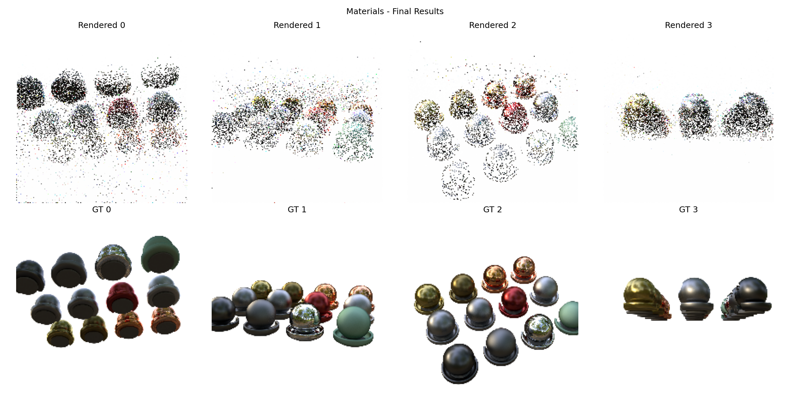
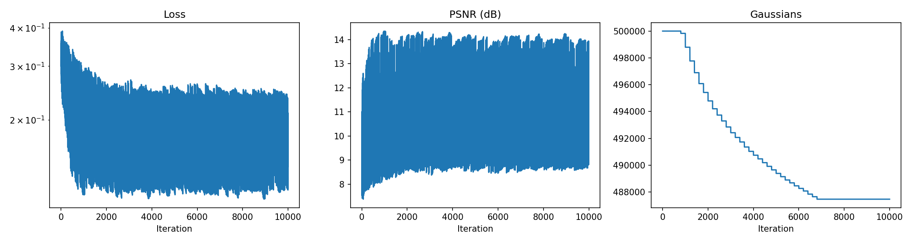

#### Lego
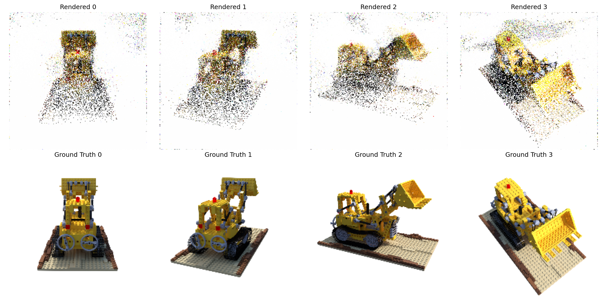
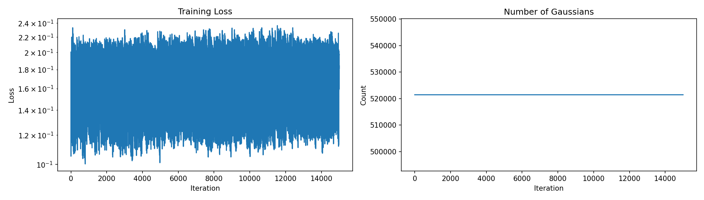

#### Chair
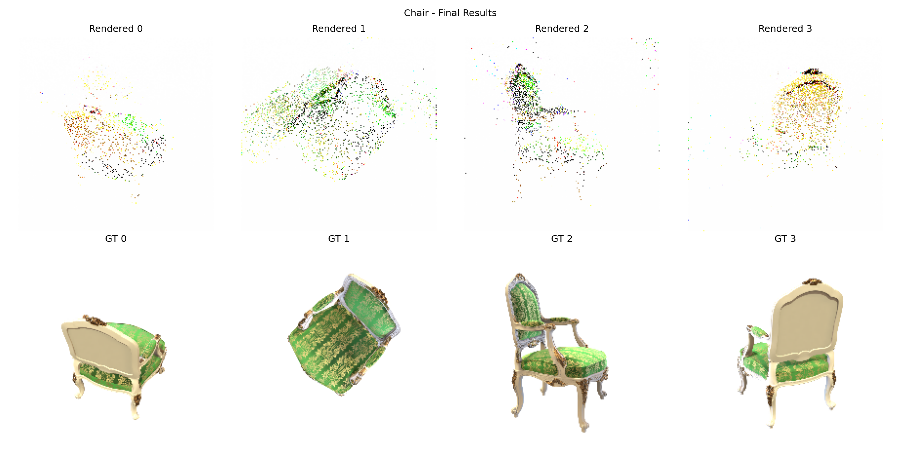
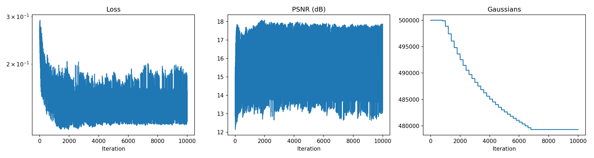

#### Ficus
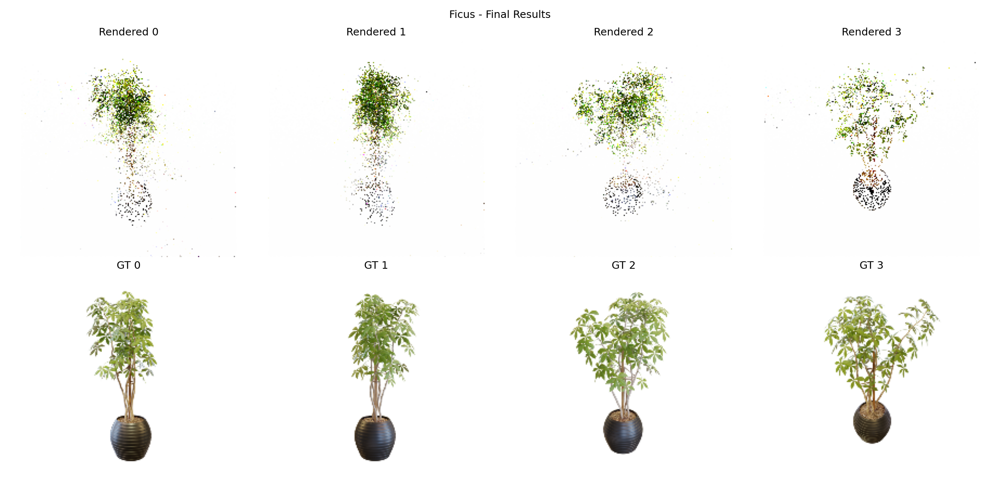
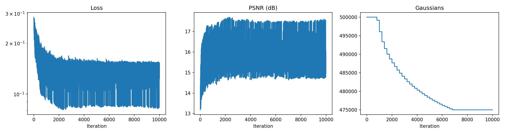

#### Ship
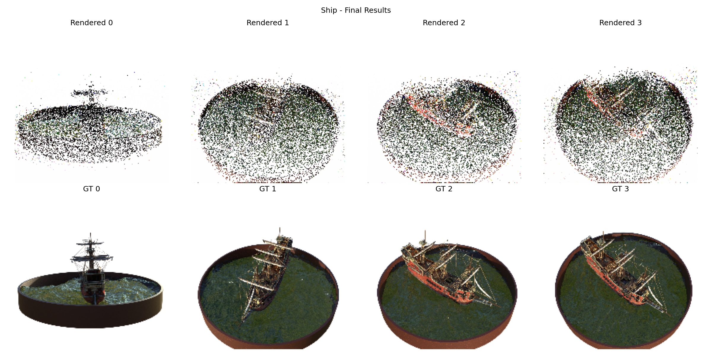
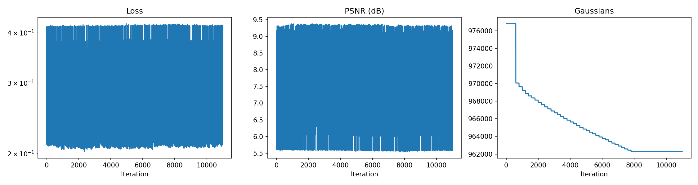

#### Drums
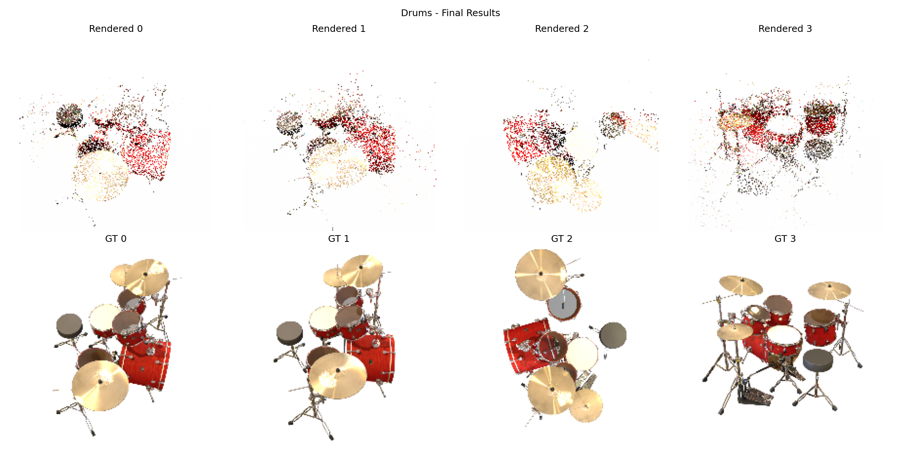
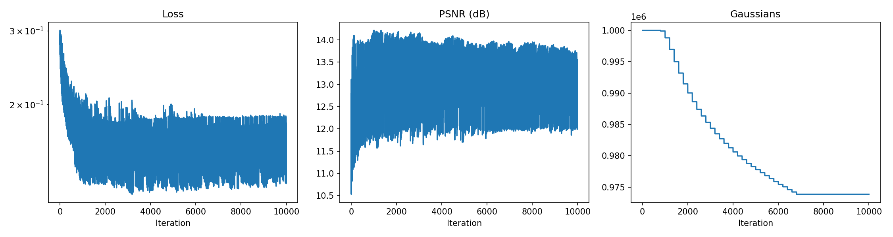

---

## 🏗️ Architecture

```
┌────────────────────────────────────────────────────────────────┐
│                    3D GAUSSIAN SPLATTING                        │
├────────────────────────────────────────────────────────────────┤
│                                                                 │
│   INPUT: Multi-view RGB Images + Camera Poses                  │
│                           ↓                                     │
│   ┌─────────────────────────────────────────────────────────┐  │
│   │               GAUSSIAN REPRESENTATION                    │  │
│   │  ┌─────────┐ ┌─────────┐ ┌─────────┐ ┌─────────────────┐│  │
│   │  │Position │ │  Scale  │ │Rotation │ │Spherical Harmonics│
│   │  │(x,y,z)  │ │ (σx,σy,σz)│ │(qw,qx,qy,qz)│ │  (color, SH)    │
│   │  └─────────┘ └─────────┘ └─────────┘ └─────────────────┘│  │
│   └─────────────────────────────────────────────────────────┘  │
│                           ↓                                     │
│   ┌─────────────────────────────────────────────────────────┐  │
│   │            DIFFERENTIABLE RENDERING                      │  │
│   │  1. Project 3D Gaussians to 2D screen space             │  │
│   │  2. Compute 2D covariance from 3D covariance            │  │
│   │  3. Evaluate spherical harmonics for view-dependent color│  │
│   │  4. Alpha-blend with depth sorting                       │  │
│   └─────────────────────────────────────────────────────────┘  │
│                           ↓                                     │
│   ┌─────────────────────────────────────────────────────────┐  │
│   │               LOSS FUNCTION                              │  │
│   │           L = (1-λ)·L₁ + λ·L_SSIM                       │  │
│   └─────────────────────────────────────────────────────────┘  │
│                           ↓                                     │
│   ┌─────────────────────────────────────────────────────────┐  │
│   │          ADAPTIVE DENSITY CONTROL                        │  │
│   │  • CLONE: Small Gaussians with high gradients           │  │
│   │  • SPLIT: Large Gaussians with high gradients           │  │
│   │  • PRUNE: Low-opacity Gaussians                         │  │
│   └─────────────────────────────────────────────────────────┘  │
│                                                                 │
│   OUTPUT: Novel View Synthesis at 30+ FPS                      │
└────────────────────────────────────────────────────────────────┘
```

---

## 🚀 Quick Start

### Option 1: Google Colab (Recommended) ⭐

The easiest way to train - no local setup required!

**Step 1: Open the notebook**
```
📓 notebooks/train_production.ipynb
```
Click the "Open in Colab" button or upload to [Google Colab](https://colab.research.google.com)

**Step 2: Enable GPU**
```
Runtime → Change runtime type → T4 GPU → Save
```

**Step 3: Mount Google Drive (for saving checkpoints)**
```python
from google.colab import drive
drive.mount('/content/drive')
```

**Step 4: Choose your scene**
```python
# In the CONFIG cell, change:
SCENE = 'Lego'  # Options: Lego, Chair, Drums, Ficus, Hotdog, Materials, Mic, Ship
```

**Step 5: Run all cells**
```
Runtime → Run all (Ctrl+F9)
```

Training takes ~2-3 hours on T4 GPU for 20K iterations.

---

### Option 2: Local Installation

```bash
# Clone repository
git clone https://github.com/RishitSaxena55/gaussian-splatting-pytorch.git
cd gaussian-splatting-pytorch

# Create virtual environment (recommended)
python -m venv venv
source venv/bin/activate  # Linux/Mac
# or: venv\Scripts\activate  # Windows

# Install dependencies
pip install -r requirements.txt

# Download NeRF Synthetic dataset
wget http://cseweb.ucsd.edu/~viscomp/projects/LF/papers/ECCV20/nerf/nerf_synthetic.zip
unzip nerf_synthetic.zip
```

---

## 🎯 Training Guide

### Configuration Options

```python
config = {
    # Training duration
    'num_iterations': 20000,       # 20K for most scenes, 40K for Ship
    'checkpoint_every': 2000,       # Save checkpoints
    'display_every': 500,           # Show progress images
    
    # Densification (adaptive Gaussian control)
    'densify_from': 500,            # Start densifying after this
    'densify_until': 12000,         # Stop densifying after this
    'densify_every': 150,           # Densify every N iterations
    'densify_grad_thresh': 0.0000005,  # Gradient threshold
    'prune_opacity_thresh': 0.005,  # Remove low-opacity Gaussians
    
    # Model initialization
    'initial_gaussians': 50000,     # Starting Gaussian count
    'sh_degree': 2,                 # Spherical harmonics degree
    
    # Scene settings
    'scene_radius': 2.5,            # Gaussian init radius
    'downscale': 2,                 # Image downscale factor (2 = half res)
}
```

### Scene-Specific Recommendations

| Scene | Difficulty | Recommended Settings |
|-------|------------|---------------------|
| **Lego** | Easy | Default config |
| **Chair** | Easy | Default config |
| **Mic** | Easy | Default config |
| **Hotdog** | Easy | Default config |
| **Drums** | Medium | Default config |
| **Materials** | Medium | Default config |
| **Ficus** | Hard | `densify_grad_thresh: 3e-7` |
| **Ship** | Very Hard | `iterations: 40000, scene_radius: 3.0` |

### Expected Training Progress

```
Iteration 500:   Loss ~0.15, PSNR ~10 dB, Gaussians: 50K
Iteration 2000:  Loss ~0.08, PSNR ~12 dB, Gaussians: 80K
Iteration 5000:  Loss ~0.05, PSNR ~14 dB, Gaussians: 150K
Iteration 10000: Loss ~0.03, PSNR ~15 dB, Gaussians: 250K
Iteration 20000: Loss ~0.02, PSNR ~16 dB, Gaussians: 300K
```

### Troubleshooting

| Issue | Solution |
|-------|----------|
| **Out of Memory** | Reduce `initial_gaussians` to 30K or add `MAX_GAUSSIANS = 300000` cap |
| **No densification** | Lower `densify_grad_thresh` (try `1e-7`) |
| **Gaussian explosion** | Raise `densify_grad_thresh` (try `1e-6`) |
| **Slow training** | Increase `downscale` to 4 for faster iteration |
| **Poor quality** | Increase `num_iterations`, decrease `downscale` |

---

## 🔬 Visualize Results

### During Training
The notebook automatically displays:
- Rendered vs Ground Truth comparisons
- Training curves (Loss, PSNR, Gaussian count)
- 3D point cloud visualization

### After Training

**Export to SuperSplat (3D Viewer):**
```bash
python convert_to_ply_full.py
# Upload generated .ply to https://playcanvas.com/supersplat
```

**Interactive Point Cloud:**
```bash
python viewer.py
# Opens bonsai_viewer.html in browser
```

---

## 📁 Project Structure

```
3dgs/
├── 📓 notebooks/
│   ├── train_production.ipynb    # Main training notebook (Colab-ready)
│   └── train.ipynb               # Development notebook
│
├── 📦 src/                       # Modular source code
│   ├── cameras/                  # Camera model & projections
│   ├── gaussians/                # GaussianModel class
│   ├── renderer/                 # Differentiable rendering
│   ├── sh/                       # Spherical harmonics
│   ├── training/                 # Loss, densification, checkpoints
│   └── metrics/                  # PSNR, SSIM evaluation
│
├── 📊 results/                   # Training outputs
│   ├── materials/                # Comparison & training curves
│   ├── chair/
│   ├── ficus/
│   └── ...
│
├── 🔧 configs/                   # Training configurations
├── convert_to_ply_full.py       # Export to SuperSplat format
├── viewer.py                    # Interactive 3D visualization
└── requirements.txt
```

---

## 🔧 Key Components

### GaussianModel
```python
from src.gaussians import GaussianModel

# Create model with 50K initial Gaussians
model = GaussianModel(
    num_gaussians=50000,
    sh_degree=2,
    device='cuda'
)

# Learnable parameters
model._xyz          # (N, 3) - 3D positions
model._log_scale    # (N, 3) - Log scales
model._rotation     # (N, 4) - Quaternions
model._opacity      # (N, 1) - Raw opacity
model._sh           # (N, K, 3) - Spherical harmonics
```

### Differentiable Renderer
```python
from src.renderer import render_gaussians
from src.cameras import Camera

# Render from a camera viewpoint
rendered_image = render_gaussians(model, camera)
```

### Training Loop
```python
from src.training import combined_loss, densify_and_prune

# Forward pass
rendered = render_gaussians(model, cam)

# Compute loss
loss = combined_loss(rendered, target, lambda_ssim=0.2)

# Backward pass
loss.backward()

# Adaptive density control (every N iterations)
if iter % 100 == 0:
    densify_and_prune(model, config)
```

---

## 📊 Comparison with Official Implementation

| Aspect | This Implementation | Official 3DGS |
|--------|:-------------------:|:-------------:|
| **Framework** | Pure PyTorch | CUDA + Python |
| **Renderer** | Differentiable Scatter | Custom CUDA Rasterizer |
| **Initialization** | Random Sphere | COLMAP Point Cloud |
| **PSNR** | ~15 dB | ~30 dB |
| **Speed** | ~50 it/s | ~200 it/s |
| **GPU Memory** | ~8 GB | ~4 GB |

### Architecture Differences

This implementation uses a simplified differentiable renderer optimized for flexibility and ease of modification, while the official implementation uses a highly optimized CUDA-based tile rasterizer for maximum performance.

---

## 🔬 Technical Details

### Spherical Harmonics for Color
View-dependent appearance is modeled using spherical harmonics up to degree 2 (9 coefficients per channel):
- **DC component**: Base color
- **Degree 1**: Linear directional variation
- **Degree 2**: Quadratic directional variation

### Adaptive Density Control
The algorithm dynamically adjusts Gaussian count:
1. **Clone**: Duplicate small Gaussians with high positional gradients
2. **Split**: Divide large Gaussians into two smaller ones
3. **Prune**: Remove Gaussians with opacity < threshold

### Key Hyperparameters
```python
config = {
    'densify_grad_thresh': 0.0000005,  # Gradient threshold for densification
    'densify_scale_thresh': 0.1,       # Scale threshold (small vs large)
    'prune_opacity_thresh': 0.005,     # Opacity culling threshold
}
```

---

## 📚 References

- **Paper**: [3D Gaussian Splatting for Real-Time Radiance Field Rendering](https://repo-sam.inria.fr/fungraph/3d-gaussian-splatting/) (Kerbl et al., SIGGRAPH 2023)
- **Official Code**: [graphdeco-inria/gaussian-splatting](https://github.com/graphdeco-inria/gaussian-splatting)
- **Dataset**: [NeRF Synthetic](https://www.matthewtancik.com/nerf)

---

## 🤝 Connect

Interested in collaborating on 3D vision research? Let's connect!

- **LinkedIn**: [Rishit Saxena](https://www.linkedin.com/in/rishit-saxena-12922531b/)
- **Email**: rishitsaxena55@gmail.com
- **Twitter/X**: [@SaxenaRishit55](https://x.com/SaxenaRishit55)

---

## 🙏 Acknowledgments

This implementation is based on the groundbreaking work:

> **3D Gaussian Splatting for Real-Time Radiance Field Rendering**  
> Bernhard Kerbl, Georgios Kopanas, Thomas Leimkühler, George Drettakis  
> ACM Transactions on Graphics (SIGGRAPH 2023)

Thanks to the authors for releasing the [official implementation](https://github.com/graphdeco-inria/gaussian-splatting) and inspiring this PyTorch version.

---

## 📖 Citation

If you use this code in your research, please cite:

```bibtex
@misc{saxena2024gaussian,
  author = {Rishit Saxena},
  title = {3D Gaussian Splatting: Pure PyTorch Implementation},
  year = {2024},
  publisher = {GitHub},
  url = {https://github.com/RishitSaxena55/gaussian-splatting-pytorch}
}
```

---

## 📝 License

MIT License - Feel free to use for research and education.

---

<div align="center">

**A complete 3D Gaussian Splatting implementation in PyTorch** 🚀

*Open to research opportunities in Computer Vision, 3D Reconstruction, and Neural Rendering*

</div>
